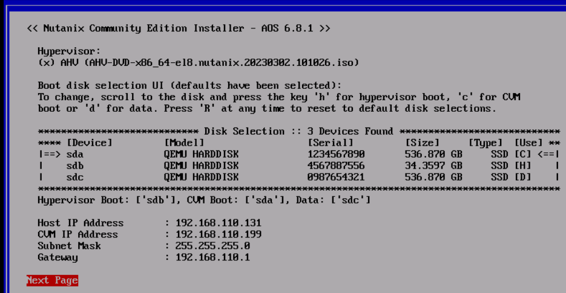
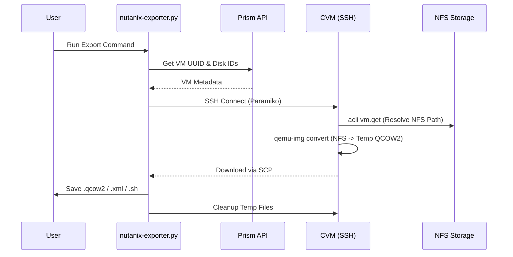

# Nutanix AHV Community Edition: Experiments & Exporter

This repository documents the installation process, architectural findings, and a fully functional Python exporter script for the **Nutanix AHV Community Edition**.

> **Note:** This project exists because the installation process is complex ("bureaucratic") and the internal architecture requires specific resource tuning to avoid crashes.

## 📋 Prerequisites & Installation

Installing the Community Edition is not straightforward. Follow these steps strictly:

### 1. Registration & Download
The installation image ("Phoenix") is gated behind several login steps:
1. **Register** on the Community Forum: [Nutanix Community Register](https://www.nutanix.com/products/community-edition/register)
2. **Validate** your account by logging into the portal: [Nutanix Portal](https://portal.nutanix.com/)
3. **Download** the ISO (Image name: `phoenix`) from the Next Forum: [Download Thread](https://next.nutanix.com/discussion-forum-14/download-community-edition-38417)

### 2. Virtual Machine Hardware Requirements
If running this as a nested VM (e.g., inside ESXi or KVM), you must configure the following:

* **RAM:** **32GB Minimum** (Highly recommended to allocate more).
  * *Reason:* Nutanix spawns a hidden internal VM (CVM) that consumes 16GB RAM immediately. If the host VM has insufficient RAM, components will crash silently via `oomkill`.
* **Storage:** 3 Disks (SCSI controller required).
  * **Size:** Minimum 300GB each (500GB recommended for heavier workloads).
  * **Serial Numbers:** It is **mandatory** to define a SERIAL for the virtual disks in your hypervisor config.
* **Disk Layout:** The installer creates three volumes:
  1. **CVM:** The Controller VM (Prism management UI).
  2. **Hypervisor:** The boot partition.
  3. **Data Disk:** Proprietary format.

### 3. The Installation Process

* Recommended settings: 3 separate disks, each will be used for a different role.



* The environment is a modified Rocky Linux distribution.
* Expect Python script errors on screen during installation.
* There are limited progress indicators. Be patient.
* To check if the system was configured properly, run "genesis status" and "cluster status". If the commands do not exist, the installation has failed to complete!
* The CVM VM can be checked with "virsh list". Its console is available at /var/log/NTNX.serial.0. Check it to troubleshoot potential memory issues.

* To create a single node cluster:
```
nutanix@cvm$ cluster -s cvm_ip --redundancy_factor=1 create
```

Reference: https://portal.nutanix.com/page/documents/details?targetId=Nutanix-Community-Edition-Getting-Started-v2_1:top-cluster-config-ce-t.html


---

## 🐍 Python Exporter Script (`nutanix-exporter.py`)

This repository contains a robust script to export Nutanix AHV VMs directly to QCOW2 format, allowing for migration to standard KVM/QEMU environments.

### How It Works
The script automates the retrieval of disk images by interacting with both the Prism API (for metadata) and the Controller VM (CVM) internals (for data extraction).



### Key Features

* **Remote Conversion:** Executes `qemu-img` directly on the CVM to convert proprietary/raw disk formats to QCOW2 *before* transfer, significantly reducing file size and transfer time.
* **Automatic Discovery:** Uses `acli` commands internally to resolve the hidden NFS paths for virtual disks.
* **Migration Ready:** Automatically generates **QEMU launch scripts** (`.sh`) and **Libvirt XML** (`.xml`) definitions, making the VM immediately usable in KVM/Virt-Manager.
* **Safety:** Checks if the VM is powered off before exporting to prevent data corruption (overrideable with `--force`).

### Requirements

Install the necessary Python libraries:

```bash
pip install requests paramiko scp tqdm

```

### Usage Guide

#### 1. List Available VMs (Inventory)

Check which VMs are available to export.

```bash
python3 nutanix-exporter.py 192.168.1.50 --inventory \
    --username admin \
    --password 'nutanix/4u'

```

#### 2. Basic Export (Disk Only)

Export the disks of a specific VM to the current directory.

```bash
python3 nutanix-exporter.py 192.168.1.50 "Web Server 01" \
    --cvm-user nutanix \
    --cvm-password 'nutanix/4u'

```

#### 3. Full Export (Disks + KVM Metadata)

Export the disks and generate `libvirt` XML and a standalone QEMU boot script.

```bash
python3 nutanix-exporter.py 192.168.1.50 "Web Server 01" \
    --export-all \
    --output-dir ./exported_vms

```

### Command Line Arguments

| Argument | Description | Default |
| --- | --- | --- |
| `cluster_ip` | IP of the Prism Central or CVM. | (Required) |
| `vm_name` | Name of the VM to export. | (Required for export) |
| `--inventory` | List all VMs and exit. | `False` |
| `--export-all` | Export disks, QEMU script, and Libvirt XML. | `False` |
| `--force` | Export even if VM is powered ON (Dangerous). | `False` |
| `--cvm-user` | SSH User for the Controller VM. | `nutanix` |
| `--debug` | Enable verbose logging (useful for troubleshooting SSH). | `False` |

---

## 🏗 Architecture & Internals

After significant troubleshooting, the following internal behaviors were discovered:

### The CVM (Controller VM)

* The system launches a nested VM using QEMU with **16GB of RAM** dedicated to the CVM.
* This happens in the background post-installation.
* The CVM hosts the **Prism Web UI** and the storage controller.

### Storage & Data Access

* **Format:** The data disk uses a proprietary format with block distribution similar to RAID striping.
* **Direct Access:** You cannot simply mount or copy the data disk from the host while the VM is running.
* **Access Methods:**
1. **SFTP/SCP:** The exporter script uses this method. It requires the CVM's internal `qemu-img` to consolidate the striped data into a single file.
2. **Internal NFS:** Revealed via `acli` commands or logs. Restricted permissions (mostly Root only).


### Useful commands

* **To reset the admin password:**:
```
# allssh 'sudo faillock --user admin --reset'
```


### Internal Component Names (Greek/Sci-Fi Theme)

* **Acropolis (`acli`):** The Manager.
* **Zeus:** Cluster Manager component.
* **Cassandra:** Metadata storage.
* **Stargate:** I/O handling.
* **Genesis:** Configuration.
* **Prism:** Web UI.

---

## 🔐 Credentials

| User | Password | Context |
| --- | --- | --- |
| `admin` | `nutanix/4u` | **Prism Web UI / API** (Used for VM discovery) |
| `nutanix` | `nutanix/4u` | **CVM SSH** (Used for disk conversion & SCP) |
| `root` | `nutanix/4u` | **System Root** (OS Level access) |

---

## ⚠️ Known Issues

* **NFS3ERR_JUKEBOX:** This error code occasionally appears in logs. It is a reserved SCSI error for CD Jukeboxes, but in this context, it usually indicates I/O corruption or a timeout on the underlying data disk. The script attempts to catch this and warn the user.
* **Environment Stability:** Requires a clean, high-memory environment to function reliably. Frequent power cycling of the nested environment can corrupt the internal storage map.

```

```
