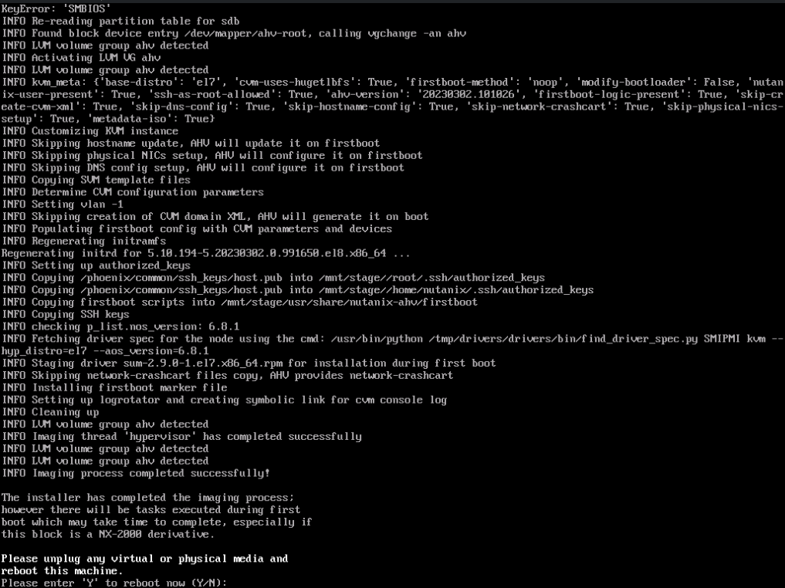
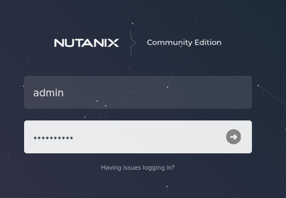
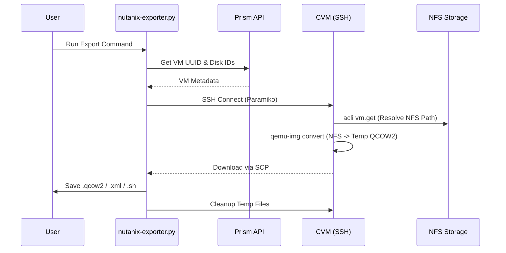

# Nutanix AHV Community Edition: Experiments & Exporter

This repository documents the installation process, architectural findings, and a fully functional Python exporter script for the **Nutanix AHV Community Edition**.

> **Note:** This project exists because the installation process is complex ("bureaucratic") and the internal architecture requires specific resource tuning to avoid crashes.

## 🏗 Architecture & Internals

After significant troubleshooting, the following internal behaviors were discovered:

### The CVM (Controller VM)

* The system launches a nested VM using QEMU with **16GB of RAM** dedicated to the CVM.
* This happens in the background post-installation.
* The CVM hosts the **Prism Web UI** and the storage controller.

### Storage & Data Access

* **Format:** The data disk uses a proprietary format with block distribution similar to RAID striping.
* **Direct Access:** You cannot simply mount or copy the data disk from the host while the VM is running.
* **Access Methods:**
1. **SFTP/SCP:** The exporter script uses this method. It requires the CVM's internal `qemu-img` to consolidate the striped data into a single file.
2. **Internal NFS:** Revealed via `acli` commands or logs. Restricted permissions (mostly Root only).


### Internal Component Names (Greek/Sci-Fi Theme)

* **Acropolis (`acli`):** The Manager.
* **Zeus:** Cluster Manager component.
* **Cassandra:** Metadata storage.
* **Stargate:** I/O handling.
* **Genesis:** Configuration.
* **Prism:** Web UI.

---

## 🔐 Credentials

| User | Password | Context |
| --- | --- | --- |
| `admin` | `nutanix/4u` | **Prism Web UI / API** (Used for VM discovery) |
| `nutanix` | `nutanix/4u` | **CVM SSH** (Used for disk conversion & SCP) |
| `root` | `nutanix/4u` | **System Root** (OS Level access) |

---

## ⚠️ Known Issues

* **NFS3ERR_JUKEBOX:** This error code occasionally appears in logs. It is a reserved SCSI error for CD Jukeboxes, but in this context, it usually indicates I/O corruption or a timeout on the underlying data disk. The script attempts to catch this and warn the user.
* **Environment Stability:** Requires a clean, high-memory environment to function reliably. Frequent power cycling of the nested environment can corrupt the internal storage map.

## 📋 Prerequisites & Installation

Installing the Community Edition is not straightforward. Follow these steps strictly:

### 1. Registration & Download
The installation image ("Phoenix") is gated behind several login steps:
1. **Register** on the Community Forum: [Nutanix Community Register](https://www.nutanix.com/products/community-edition/register)
2. **Validate** your account by logging into the portal: [Nutanix Portal](https://portal.nutanix.com/)
3. **Download** the ISO (Image name: `phoenix`) from the Next Forum: [Download Thread](https://next.nutanix.com/discussion-forum-14/download-community-edition-38417)

### 2. Virtual Machine Hardware Requirements
If running this as a nested VM (e.g., inside ESXi or KVM), you must configure the following:

* **RAM:** **32GB Minimum** (Highly recommended to allocate more).
  * *Reason:* Nutanix spawns a hidden internal VM (CVM) that consumes 16GB RAM immediately. If the host VM has insufficient RAM, components will crash silently via `oomkill`.
* **Storage:** 3 Disks (SCSI controller required).
  * **Size:** Minimum 300GB each (500GB recommended for heavier workloads). The Hypervisor volume can be smaller (32GB). The [official documentation](https://portal.nutanix.com/page/documents/details?targetId=Nutanix-Community-Edition-Getting-Started-v2_1:top-sysreqs-ce-r.html) says 32GB for Hypervisor, 200GB for CVM and 500GB for storage.
  * **Serial Numbers:** It is **mandatory** to define a SERIAL for the virtual disks in your hypervisor config.
* **Disk Layout:** The installer creates three volumes:
  1. **CVM:** The Controller VM (Prism management UI).
  2. **Hypervisor:** The boot partition.
  3. **Data Disk:** Proprietary format.

### 3. The Installation Process

* Recommended settings: 3 separate disks, each will be used for a different role.


* The environment is a modified Rocky Linux distribution.
* Expect Python script errors on screen during installation.
* There are limited progress indicators. Be patient.



* After the reboot, please wait for the CVM VM to be instantiated, and 15-20min for the storage setup to finish.

* The CVM VM can be checked with "virsh list". Its console is available at /var/log/NTNX.serial.0. Check this log to troubleshoot potential memory issues and see if it booted correctly.

* To check if the system was configured properly, first ssh to the internal CVM IP at 192.168.5.2 (user is "nutanix"). From there, run "genesis status" and "cluster status". If the commands do not exist, the installation has failed to complete (or you tried it too soon). Genesis is responsible for starting all the auxiliary services, like zookeeper, hadoop, prism, cassandra, etc. If it's just showing a couple of services, check the logs at /var/log (especially firstboot* and messages) for issues. Remember that most services will *NOT* show up until you create the cluster.

* It's mandatory to create a cluster. You can also create a single node cluster from the CVM:
```
nutanix@cvm$ cluster -s <EXTERNAL CVM IP> --redundancy_factor=1 create
```
* There is a long list of services that are configure and started one by one. This could take up to 10 minutes. When it's done, you'll see a list of all the services marked as "UP" and "Success!".

* You can also use the "cluster status" and "genesis status" commands in the CVM to confirm the cluster is up with all the required services.

Reference: https://portal.nutanix.com/page/documents/details?targetId=Nutanix-Community-Edition-Getting-Started-v2_1:top-cluster-config-ce-t.html

* Once the CVM + cluster is up, you must log to the Prism WebUI at https://<CVM IP>:9044. The user is "admin" and the password is "nutanix/4u". You'll be asked to create a new password.




Have your NEXT Community Portal credentials ready, you'll be asked for them in the next step.

* You should now be able to see the dashboard:

!(nutanix-ahv-install-5.png)

From here on, you can access the main areas via the drop list on the top bar, like "Storage", "VM", "Network", etc.

### Useful commands

* **To reset the admin password:**:
```
# allssh 'sudo faillock --user admin --reset'
```

---

## 🐍 Nutanix AHV to QCOW2 Exporter

This utility exports Virtual Machines from a Nutanix AHV cluster directly to a local directory. It converts Nutanix storage formats (VMDK/Raw) into portable QCOW2 images, generates ready-to-boot QEMU launch scripts, and creates Libvirt/KVM XML definitions.

It is designed to handle "hostile" cluster environments, featuring self-healing SSH connections, API-first download strategies, and robust fallback mechanisms for locked or "zombie" files.

## Features

* **Full Hardware Fidelity:** Captures exact CPU topology (Sockets/Cores/Threads), RAM, MAC addresses, and Disk Bus types (SCSI/SATA/IDE).
* **Zero-Config Boot:** Generates `start_vm.sh` (QEMU) and `vm.xml` (Libvirt) that boot immediately on standard Linux KVM hosts.
* **Resilient Transfer:** Automatically retries dropped SSH connections and handles CVM resource limits.
* **Smart Export:** * Prioritizes high-speed HTTPS downloads via Prism API.
* Falls back to low-level NFS/QEMU tools if the API is unavailable.
* Includes a "Raw Mode" fallback for locked/corrupted images (fixing `NFS3ERR_JUKEBOX`).


* **Audit Trail:** Dumps the original Nutanix JSON configuration and disk layout for archival purposes.

## Prerequisites

The script requires Python 3 and the following libraries:

```bash
pip install paramiko scp tqdm requests

```

## Usage

```bash
python3 nutanix-exporter.py [OPTIONS] CLUSTER_IP [VM_NAME]

```

### Positional Arguments

| Argument | Description |
| --- | --- |
| `CLUSTER_IP` | The IP address of the Nutanix CVM or Prism VIP. |
| `VM_NAME` | The exact name of the VM to export. (Required unless using `--inventory`) |

### Authentication Parameters

| Flag | Description |
| --- | --- |
| `-u`, `--username` | Prism Web Console username (default: `admin`). |
| `-p`, `--password` | Prism Web Console password. If omitted, uses `NUTANIX_PASSWORD` env var or prompts securely. |
| `--cvm-user` | SSH username for the CVM (default: `nutanix`). |
| `--cvm-password` | SSH password for the CVM. If omitted, uses `CVM_PASSWORD` env var or prompts securely. |

### Export Options

| Flag | Description |
| --- | --- |
| `--export-all` | **Recommended.** Exports disks, generates QEMU script, and creates Libvirt XML. |
| `--export-def` | Generates a standalone QEMU shell script (`start_vm.sh`). |
| `--export-xml` | Generates a Libvirt/KVM XML definition file (`vm.xml`). |
| `--export-cdroms` | Also attempts to download attached ISO images from CD-ROM drives. |
| `-o`, `--output-dir` | Directory to save exported files (default: current directory). |

### Operational Flags

| Flag | Description |
| --- | --- |
| `--inventory` | Lists all available VMs on the cluster and exits. |
| `--debug` | Enables verbose logging (SSH traffic, API responses, raw commands). |
| `--force` | Forces export even if the VM is powered ON (Warning: Data inconsistency risk). |

---

## Examples

### 1. List available VMs

Check the names of VMs currently on the cluster.

```bash
python3 nutanix-exporter.py 192.168.1.50 --inventory

```

### 2. Standard Full Export

Export a VM named "WebServer-01" including all configs, saving to a `backup` folder.

```bash
python3 nutanix-exporter.py 192.168.1.50 "WebServer-01" \
  --export-all \
  -o ./backups

```

### 3. Full "Jailbreak" Backup (Including ISOs)

Export the VM and its attached installation media (CD-ROMs), using verbose debug mode to trace connection issues.

```bash
python3 nutanix-exporter.py 192.168.1.50 "sles16-test" \
  --export-all \
  --export-cdroms \
  --debug \
  -o ./sles_export

```

### 4. Non-Interactive (CI/CD Friendly)

Use environment variables to avoid password prompts.

```bash
export NUTANIX_PASSWORD="myPrismPassword"
export CVM_PASSWORD="mySshPassword"

python3 nutanix-exporter.py 192.168.1.50 "Jenkins-Agent" --export-all --force

```

---

## Output Files

After a successful run, your output directory will contain:

* **`VMNAME_DISK-UUID.qcow2`**: The converted virtual hard drives.
* **`VMNAME_DISK-UUID.iso`**: (Optional) Downloaded CD-ROM images.
* **`start_VMNAME.sh`**: A standalone shell script to boot the VM using `qemu-system-x86_64`.
* **`VMNAME.xml`**: A definition file importable into `virt-manager` (virsh).
* **`VMNAME_nutanix.json`**: The raw API configuration dump (CPU, RAM, metadata).
* **`VMNAME_acli_layout.json`**: The internal storage layout dump (NFS paths).

## Troubleshooting

### "Image is locked by Nutanix Image Service (NFS3ERR_JUKEBOX)"

* **Cause:** The file is "cold" or locked by a zombie process on the Nutanix cluster.
* **Solution:** The script handles this automatically.
1. It first tries to download via the Prism API.
2. If the API fails (404/500), it tries `qemu-img` via SSH.
3. If `qemu-img` fails (Jukebox error), it logs a warning and skips the specific file to ensure the rest of the VM is saved.


* **Manual Fix:** If you absolutely need that specific ISO, log into Prism Element and "Clone" the image in the Image Configuration settings, then point the VM to the new clone.

### "ChannelException(2, 'Connect failed')"

* **Cause:** The Nutanix CVM (CentOS) limits the number of SSH sessions or PTYs allowed per connection.
* **Solution:** The script includes a **self-healing SSH client** (`_get_ssh_client`). It will automatically detect the drop, close the socket, wait 1 second, and reconnect to retry the command transparently.


### How It Works
The script automates the retrieval of disk images by interacting with both the Prism API (for metadata) and the Controller VM (CVM) internals (for data extraction).


---

